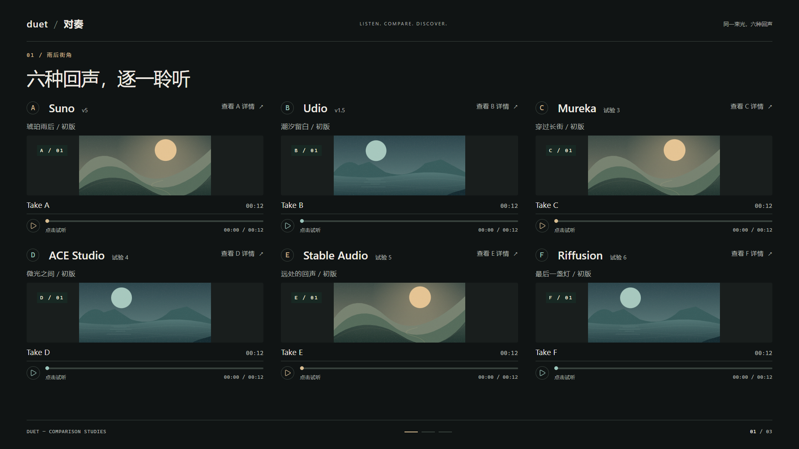
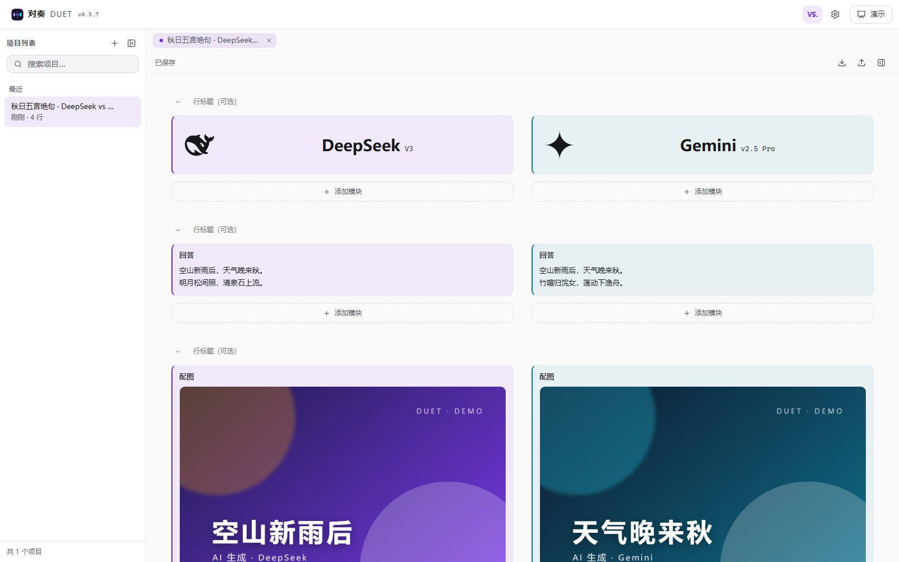
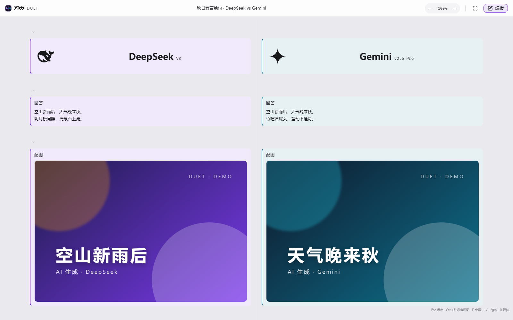
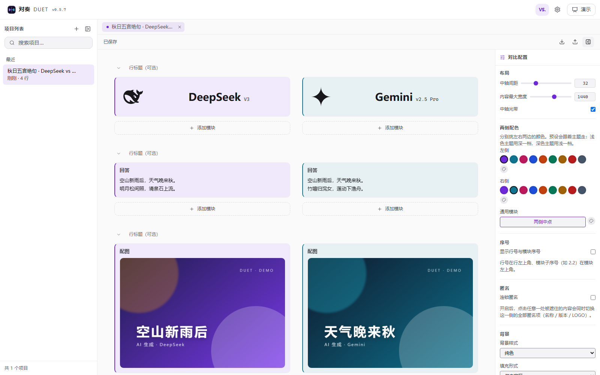
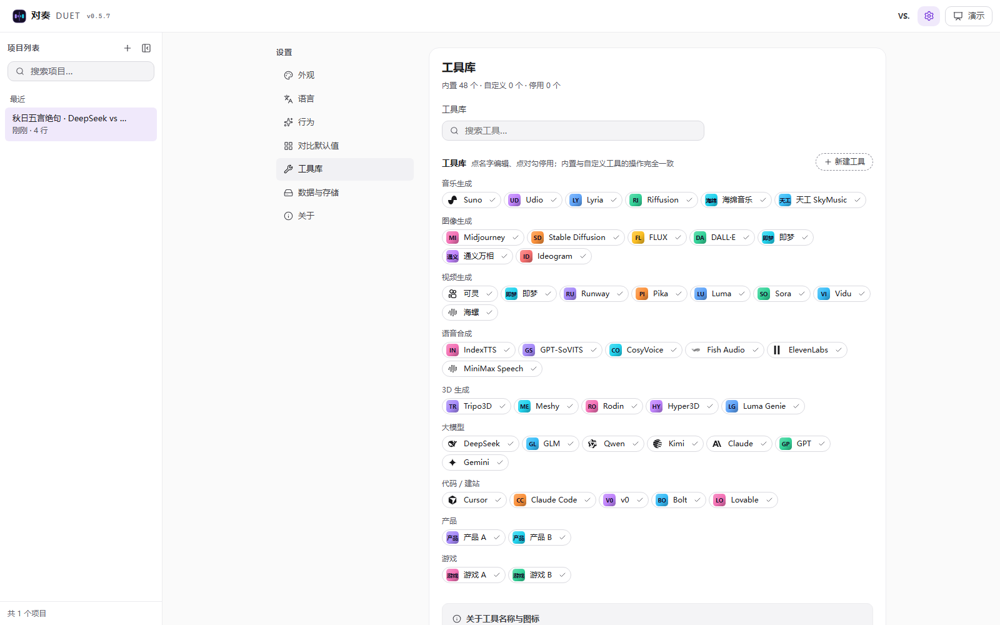
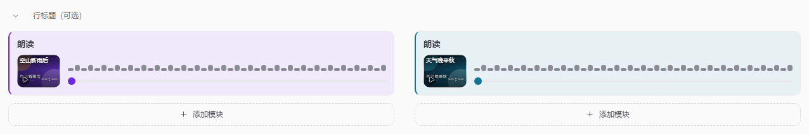

<div align="center">

# 对奏 Duet

**让不同工具，同台演奏同一道题。**
*Same prompt. Multiple tools. One stage.*

专注**内容横向对比**的本地优先 Web 应用

</div>

---

## 这是什么

对奏把 2—6 个工具在**同一套输入**下的产出，按模块并置成一张可编辑、可展示、可导出的对比页。

- 🎵 对比 Suno 与 Lyria 在同一段提示词下的音乐
- 🎬 对比可灵与即梦的生成视频
- 🧊 对比 Tripo3D 与 Meshy 的 3D 模型
- 🗣️ 对比 IndexTTS 与 GPT-SoVITS 的合成音频
- 🖼️ 对比 Midjourney 与 Stable Diffusion 的生图效果
- 💻 对比 GLM 与 DeepSeek 的网页制作
- 💰 甚至可以是两个产品的价格对比、两款游戏的可玩性对比

**参评对象可以是任何工具或产品。** 每个模块的标题都能改写成你需要的维度（把"文字"改成"价格"或"简评"），同一种模块也可以重复添加。

## 界面

**v0.9.0 · R4 多方对比**：同一测试题支持 2—6 个工具，每个工具可保存多份作品。三方横排、四方 2×2、五至六方 3×2；可切换全体总览、固定参照的重点双人视图和单项视图，保留作品选择与对象顺序。



旧项目点击“另存舞台副本”体验新界面，原稿保留。PNG 可导出当前步骤、完整场景或阅读报告；HTML 支持离线作品切换与步骤演示，超限可选择静态阅读页；`.duet` 保留全部可编辑数据。旧工程升级至 schema 10 后保留恢复快照。添加对象的入口是「作品与流程 → 对比对象」；使用方式与实测画面见 [R4 验收记录](docs/07-R4多方对比验收.md)。截图内容为验收示例，不代表平台性能结论。

顶栏“展示样板”及 `#/showcase` 仍可访问 [R1 视觉样板](docs/04-R1视觉规范与验收.md)，其中的临时修改不写入项目。

以下是现有项目的兼容画布：

下面都是**真实运行的截屏**（不是设计稿）：把 DeepSeek 与 Gemini 对同一句提示的回答、
配图与朗读并排放在一起。

**编辑视图** —— 卡片本身就是最终效果，改内容直接在卡片上改：



**演示视图** —— 同一份内容切成只读全屏，顶栏只留缩放 / 全屏 / 返回编辑：



**对比配置** —— 布局、两侧配色、序号、匿名、背景、聚光灯都在这里调：



**工具库** —— 内置 47 个常见 AI 工具（品牌图标可一键抓取），也能自建：



**音频模块** —— 波形与进度条用本侧工具的主题色，进度条已播放段也是：



## 核心特性

| 特性 | 说明 |
| --- | --- |
| **编辑 / 展示双视图** | 编辑视图里卡片**就是最终效果**（与展示视图共用同一个呈现组件），细节在模块编辑弹窗里调；展示视图只读、动效全开，适合对外演示与录制对比视频 |
| **23 种对比模块** | 封面、图片、图集、音频、视频、3D 模型、歌词、进度条、文字、Markdown、富文本、备注、参数表、链接、评分条、星级、标签组、时间线、代码块、**代码对比**、网页嵌入、分割线、占位块。可任意增删、自由改名、重复添加 |
| **工具卡片与工具选择** | 从工具库挑选生产源，自定义名称 / 版本 / 备注 / 图标，并逐项控制卡片上显示什么 |
| **拖拽排版** | 拖行头空白处调行序、拖模块卡片调模块序、拖侧栏与配置面板边缘调宽度，顺序与尺寸随工程文件保存 |
| **空模块自动隐藏** | 没填内容的模块在展示视图不会出现，不留空白；有内容的也能单独隐藏 |
| **音频双轨同步播放** | 两条音轨共用一个时钟源，A/B 对比试听，支持 Solo 与漂移校正；自动读取 mp3 内嵌封面 |
| **本地优先** | 数据全部存在浏览器 IndexedDB，无账号、无服务器、无上传；双击即用 |
| **工程文件可携带** | 对比页可导出为 `.duet` 文件，也能导出长图 PNG 与只读 HTML |
| **可安装 / 可离线** | 支持安装到桌面（PWA），装过之后断网也能打开 |
| **多项目管理** | 像 Obsidian 一样：左侧项目列表 + 顶部标签页，可同时打开多个对比 |
| **四套主题 + 中英双语** | 跟随系统 / 暗 / 亮 / 紫夜，默认跟随系统；全部文字对比度经脚本**逐主题**校验满足 WCAG AA |

## 技术栈

Vue 3 · TypeScript（strict）· Pinia · Vite · IndexedDB（零依赖手写封装）· CSS 变量主题系统

零运行时依赖的"自研件"：LRC 解析、Markdown 渲染、HTML 净化、glTF/GLB 解析、
WebGL 静态模型查看器、行级文本对比（LCS）、PNG/ICO/ICNS 图标生成。

## 开发

```bash
npm install

npm run dev            # 开发服务器
npm run test           # 单元测试（Vitest）
npm run test:e2e       # 端到端测试（Playwright）
npm run check          # 编码 + 类型 + 对比度 + Lint + 单测，一次跑全
npm run build          # 生产构建（含 PWA 产物与首屏体积校验）
npm run icons          # 重新生成 PWA 图标
```

首次运行 E2E 需要安装浏览器：

```bash
npx playwright install chromium
```

### Web 与 PWA

**桌面版已停止开发，后续专注 Web 应用与 PWA。**
v0.5.8（R0）已移除 `src-tauri/`、原生平台桥接与桌面图标构建路径。

R0 同时修复了隐藏封面后的播放、只读网页的布局／主题／媒体、匿名导出、字段标签和弹窗焦点。
实施范围与验证结果见 [R0 验收记录](docs/03-R0验收记录.md)。
浏览器内可选择或拖入本地素材、下载工程文件；远程素材读取失败时，请先下载再导入。

升级方向与分阶段范围见 [Web 体验升级规划](docs/02-Web体验升级规划.md)。
多样本、按键演示与六方对比已落地；个人版式预设及更多分享能力继续按 R5 推进。

## 项目文档

| 文档 | 内容 |
| --- | --- |
| [`docs/02-Web体验升级规划.md`](docs/02-Web体验升级规划.md) | **本轮升级依据**：展示优先、统一编辑器、多样本、按键演示、六方对比、有限自定义与实施验收 |
| [`docs/design/web-upgrade-blueprint.html`](docs/design/web-upgrade-blueprint.html) | 可交互规划原型：双人／六方展示、样本切换、重点比较、数据表与编辑器结构 |
| [`docs/01-施工总案.md`](docs/01-施工总案.md) | 历史施工依据与现有实现记录；与本轮升级规划冲突的内容以新规划为准 |
| [`docs/ADR-0001-命名.md`](docs/ADR-0001-命名.md) | 命名决策记录 |
| [`CHANGELOG.md`](CHANGELOG.md) | 版本变更 |

## 当前进度

- [x] **M0 脚手架**：外壳、主题 token、i18n、数据层骨架、测试链路、CI 级校验脚本
- [x] **M1 数据层 + 主界面 + 设置**：命令层与撤销重做、项目 CRUD 与自动保存、侧栏项目列表、标签页、对比画布、47 个内置工具与自定义工具、七组设置面板
- [x] **M2 编辑器核心**：11 种模块、媒体导入与探测、拖拽排序、属性面板、实时预览
- [x] **M3 展示视图 + 导入导出**：只读展示视图与动效、`.duet` 工程文件往返、长图 PNG、只读 HTML
- [x] **M4 动效 + 音频同步**：双轨同步播放（共用时钟、漂移校正、Solo/Mute）、真实频谱、统一 rAF 调度
- [x] **M5 扩展与分发**：23 种模块、PWA 离线与安装、存储面板（配额 / 清理 / 备份恢复）、Tauri 2 脚手架与平台适配层、发布 v0.1.0
- [x] **M6 实测反馈修订**：编辑视图改为"卡片即最终效果 + 编辑弹窗"、工具卡片重做与工具选择、拖拽调尺寸、歌词拖入与对齐、mp3 内嵌封面、黑白主题与跟随系统、侧栏调宽、lucide 图标、工具库免责声明与本地 LOGO

详见 [`docs/01-施工总案.md` §17 与 §21.10](docs/01-施工总案.md)。

## 已知限制

如实列出，避免踩坑：

- **不提供原生桌面版**：Tauri 开发已停止，保留 Web 与 PWA。
- **3D 查看器只渲染静态几何**：不支持蒙皮、动画、材质贴图与 Draco / meshopt 压缩；
  遇到不支持的模型会明确提示，而不是显示空场景。
- **代码块不做语法高亮**：对比场景需要的是行号对齐与等宽排版。
- **代码对比有规模上限**：超过约 2000×2000 行时退化为整段替换并提示，不会卡死页面。
- **网页嵌入不含 `allow-same-origin`**：嵌入页无法访问本应用数据；代价是需要自身 cookie 的站点会显示空白。
- **模块标题会出现在成稿里**：把「文字」改成「价格」后，展示与导出都会显示这个标题。
  不想要标题的模块，在编辑弹窗里把标题清空即可。
- **只在内置浏览器内核上自动验证过**：Firefox / Safari 未做自动化验证。

## 使用真实品牌 LOGO（可选，仅本机）

仓库**不内置任何第三方商标**，工具图标是按品牌色与名称首字生成的。若你希望在本机看到真实 LOGO：

```bash
npm run logos        # 下载到 public/brand-local/（该目录已被 .gitignore 排除）
```

这样做只影响你自己的实例，其他使用者克隆后仍会看到生成的几何图标。
图标来自 [Simple Icons](https://simpleicons.org)，其图标文件以 CC0 释出，
但**商标权仍归各品牌所有**——仅供本机识别使用，请勿提交到仓库或用于可能被理解为官方背书的场合。


## 开源协议

[AGPL-3.0](LICENSE)

简单说：你可以自由使用、修改、分发对奏；但如果你把它改造成**对外提供的网络服务**，必须公开你修改后的源码。

## 致谢

- 应用形态参考：开源项目「魔方简介」（单页、离线、零账号）
- 信息组织参考：Obsidian（左侧列表 + 标签页 + 可携带工程文件）
- 内容结构参考：LMArena / Artificial Analysis（左右并置 + 分维度评分）
