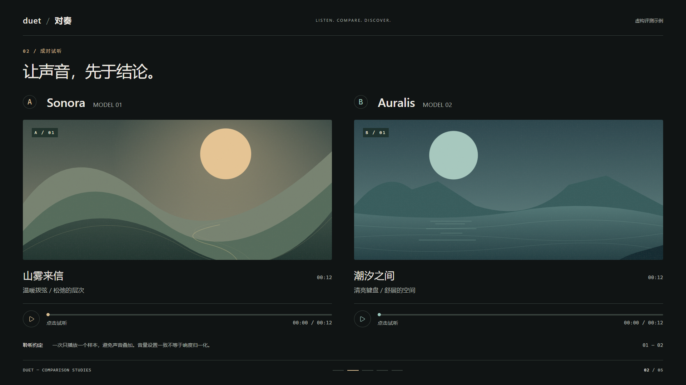
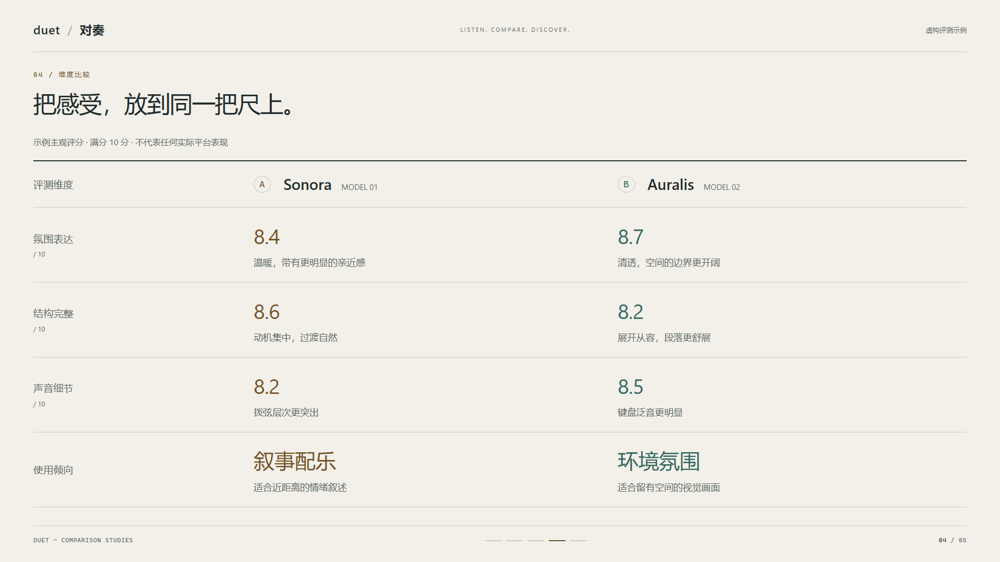
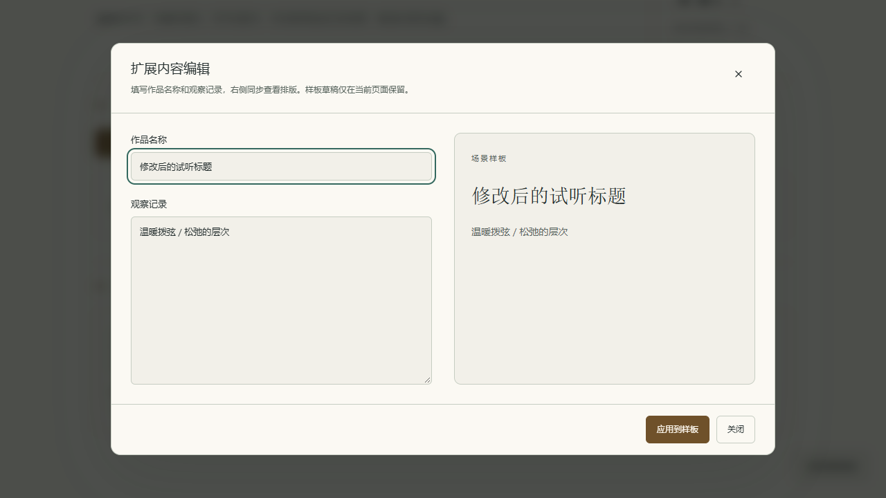

# R1 视觉规范与验收 · v0.6.0

日期：2026-09-17。R1 完成“试听舞台＋数据排版”的可运行样板及可复用组件。入口为顶栏的调色板按钮、空项目页的“展示样板”，或 `#/showcase`。项目数据结构仍为 `8`。

## 实施结果

| 任务 | 交付 |
| --- | --- |
| R1-01 视觉基础 | 墨色／纸白主题、语义色彩变量、系统字体层级、按钮／输入／错误／焦点状态、S／M／L 三种窗口及独立组件规范页 |
| R1-02 展示样板 | 命题、成对试听、媒体与观察、维度比较、结论五类场景；两段真正可播放的原创合成音频；完整的双主题样板 |
| 展示适配 | 16:9 干净画面、方向键切场景、Escape 返回；空素材状态；长内容自动展开；手机改为纵向阅读 |
| 可体验交互 | 独立试听、进度定位、A／B 焦点切换、本地音频更换与恢复、窗口内文字编辑及排版预览 |
| 集成 | 独立路由按需加载；返回已有项目；样板快捷键与项目撤销／展示快捷键隔离；中英文文案 |

## 视觉规则

色彩定义在 [`design.css`](../src/styles/design.css)，以 `data-design-theme="ink|paper"` 为作用域。基础背景与表面保持中性，A 的金色和 B 的青色只标识对象、数值与播放状态。禁止把整组评测内容重新铺成大面积彩色卡片。

| 职责 | 墨色 | 纸白 |
| --- | --- | --- |
| 舞台背景 | `#101414` | `#F2F0E9` |
| 窗口／控件表面 | `#191E1D` | `#FBF9F3` |
| 主文字 | `#EEEAE2` | `#222C2C` |
| 次文字 | `#ADB3AC` | `#59655E` |
| 对象 A | `#D9BD91` | `#765329` |
| 对象 B | `#9BC6BC` | `#34695F` |

正文使用 Segoe UI／苹方／微软雅黑等系统字体；命题和结论使用系统衬线字体；数字启用等宽数码。无外部字体请求。舞台按容器宽度等比排版，1080p 标题约 45px、命题正文 24px、观察正文约 22px；720p 保持同一构图。微型页码与品牌标记属于辅助信息。工作区表单使用固定可读字号，不跟随舞台缩放。

1080p 舞台左右边距约 64px，720p 约 43px；媒体列之间保留清晰间隔。媒体图使用完整适配，数据用统一行列和细分隔线，避免带底色的数值胶囊。原创 SVG 场景图仅服务样例，不作为真实平台的作品。

控件／面板／窗口圆角分别为 6／10／14px。按钮默认高度至少 40px，紧凑按钮 34px。窗口共用标题、说明、滚动正文与底部操作区：S 440px、M 640px、L 960px，宽高均受视口约束。L 窗口使用表单与文字预览两栏，小屏折叠成一栏。

场景切换使用 160ms 淡出与 160ms 淡入、小幅垂直位移；窗口入场 360ms。系统“减少动态效果”或应用“始终减少”设置将时长归零。没有持续闪烁的装饰动效。

## 组件与状态边界

- `StageFrame`：统一画框、标题、页脚与阅读模式。
- `StageIdentity`：小型身份标记、名称、版本和真实播放状态。
- `StageMedia`：画面、曲名、原生试听交互、真实时长、无素材／失败状态。
- `StageComparison`：语义化表格，按稳定对象 ID 匹配数值，避免依赖旧左右列索引。
- `StageScene`：五种场景的纯展示组合。
- `DButton`、`DDialog`：主题、变体和窗口尺寸统一；窗口复用 R0 焦点管理，支持初始焦点、Tab 约束、Escape 与焦点恢复。
- `useStagePlayback`：媒体元素固定在场景动画之外；一次播放一个样本，切场景、切观察对象、开窗口、切后台或离开页面时暂停。

标准样例使用虚构的 Sonora／Auralis 名称、示例评分及两段 12 秒原创合成音频，界面明确标注其性质。用户可以临时更换本地音频，实际时长由浏览器解码得到；失败显示错误状态。离开页面时回收对象 URL，不上传素材。

超长样例、过长作品名或观察文字改为自然展开的阅读布局，保留完整内容，不强制截断到一张 16:9 画面。小于 700px 的视口纵向排列，表格仅在自身范围内横向滚动。

## 验证记录

环境：Windows 11（10.0.26200）、i9-13900H、32GB 内存、Node.js 24.19.0、Edge 153.0.4234.32（无头 Chromium）。

| 检查 | 结果 |
| --- | --- |
| R1 Playwright | 13 / 13 通过：20 个中文场景／主题／尺寸组合、真实播放与定位、素材替换、损坏文件、S／M／L 窗口、焦点恢复、手机、项目返回、英文五场景及超长编辑 |
| 完整 Playwright 回归 | 79 / 79 通过，覆盖已有项目、模块编辑、导出、同步播放及 R0 修复；不包含文档截图专用用例 |
| 几何检查 | 1920×1080、1280×720，五场景×两主题；检查后代内容的实际边界，确保不与页脚相叠 |
| 静态色彩检查 | 新增两主题共 38 组文字／背景与主按钮组合，均达到 4.5:1；纳入 `check:contrast` 与生产构建 |
| 单元测试 | 29 个文件、552 项通过 |
| 生产离线复开 | Service Worker 就绪后断网并刷新；样板、两幅图、真实音频播放及组件页均可用，无页面异常 |
| 生产构建 | 类型、主题对比度、PWA 产物与首屏资源预算通过；首屏 JS gzip 约 132KB、CSS 约 5.8KB，未新增运行时依赖 |

30 次生产环境场景切换：记录 1743 个帧间隔，p50 6.1ms、p95 6.4ms、最大 30.3ms，未观察到长任务。原始数据见 [`r1-frame-times.json`](design/r1-frame-times.json)。此结果是上述本机无头浏览器观测，不代表所有设备的帧率保证；低性能设备可关闭动态效果。

新增测试位于 [`r1-showcase.spec.ts`](../e2e/r1-showcase.spec.ts)。本机使用 Edge 与工作区外的独立 Playwright 配置；常规环境安装 Chromium 后可使用 `npm run test:e2e`。测试日志及完整截图保留在工作区相邻的 `duet-r1-20260917/`。

首轮全量回归曾出现一次已有项目用例的空白页等待超时，单独重复三次及最终全量均通过，未将其归为已定位的新缺陷。新增项目往返断言也补齐了异步标题组件就绪等待。最终普通预览复看另外收紧了 720p 工作区顶部高度和缩略舞台脚注间距，并为普通预览添加内容边界检查。

## 下一阶段

R1 先固定视觉质量与组件契约，现有项目继续使用兼容画布。样板内修改仅在当前页面生效，不作为项目编辑或可导出工程保存。R2 再把新外壳、场景与窗口全面接入真实项目；多样本、完整按键演示、六方对比与受约束的布局定制沿用后续阶段规划。当前仍专注 Web／PWA。
