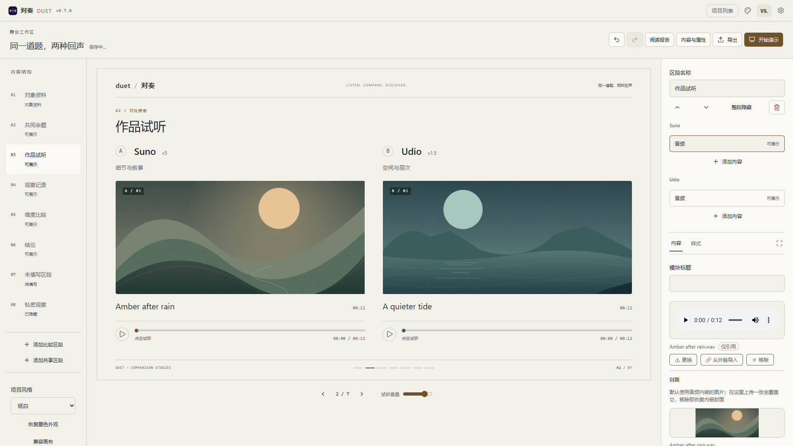
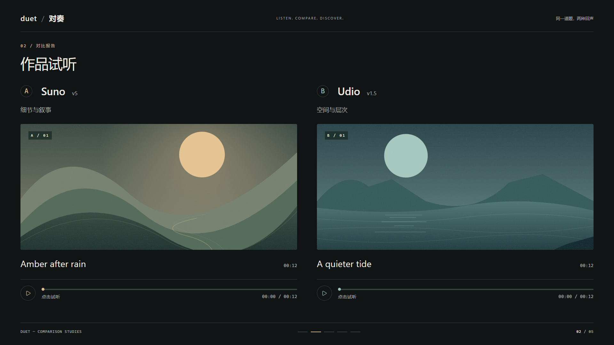
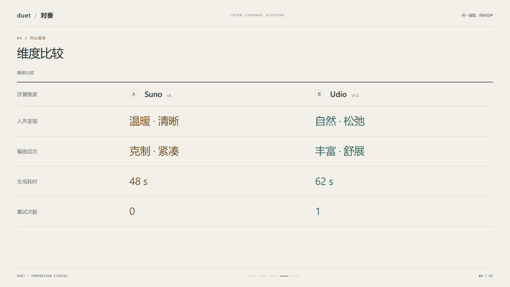
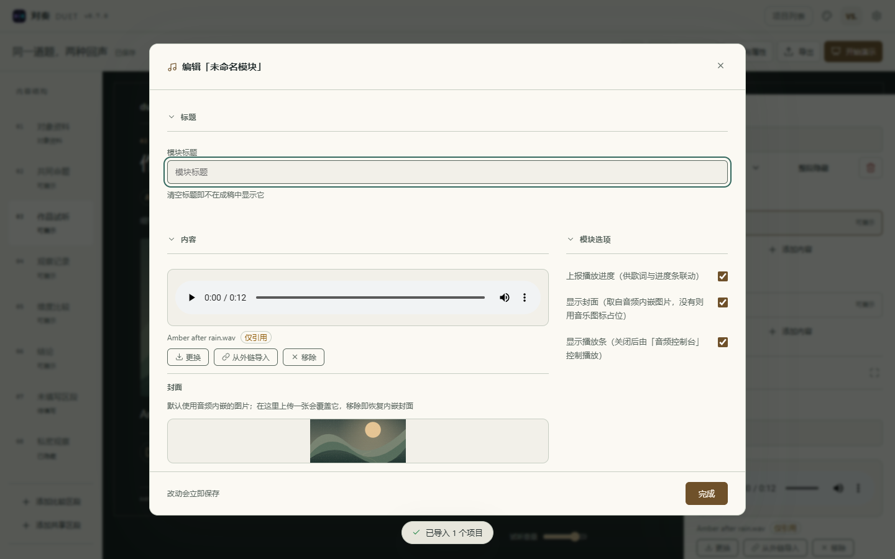

# R2 舞台工作区与验收

版本：0.7.0 · 日期：2026-09-19 · 工程结构：schema 8（无破坏性迁移）。

## 交付与入口

新建时选择音乐评测、图片评测或通用评测。新增模板直接进入舞台工作区：结构栏组织区段，中间是实际展示组件，右侧编辑内容与样式。大屏三列，小屏可开合属性区；复杂模块进入扩展编辑窗口，窗口头尾固定、内容独立滚动。

旧项目仍打开兼容画布。点击“另存舞台副本”创建独立副本，保留原稿的内容、布局和标识；舞台副本可随时切换兼容画布，再点击“回到舞台”。原画布的暗／亮／紫夜配色在画布范围内保留，工作区统一使用墨色／纸白。

## 展示与播放

- 项目风格独立保存。工作区跟随系统或外观设置，项目可固定墨色／纸白。
- 剧场使用 16:9；开始演示后隐藏编辑器，可开启干净画面。方向键／PageUp／PageDown切区段，F 全屏，Escape 依次退出全屏、干净画面和演示。
- 阅读报告连续呈现全部有内容的区段。空内容、隐藏单元格、隐藏模块不进入演示；未知模块的数据保留，可在兼容画布检查。
- 文本过长时自动展开为阅读布局，编辑器提示；不靠缩小正文或固定高度截断解决溢出。手机采用纵向阅读。
- 音频使用真实媒体、真实时长和进度，默认独听；切场景、切视图、打开导出、页面隐藏及离开工作区都会暂停。编辑／演示间保持音频 DOM 宿主与播放位置。
- 参数／评分比较使用对齐表格。维度以名称、计量尺度与重复次数匹配，避免另一侧重排后错行；零值保留，缺失显示破折号，不把未评分当成零分。

截图使用原创 SVG 封面与验收数据。音频夹具用于验证播放行为，不作为真实平台生成效果或排名。

## 模块窗口

共用工作区主题、边框、圆角、表单和焦点规则。普通模块为上方标题、左侧内容、右侧选项；宽编辑器占完整内容宽度，长标签换行。扩展编辑复用原有编辑组件和命令层，不另存一份表单数据。

舞台统一字体尺度和身份标记；旧版自由布局、工具图标、字号缩放与波形样式仍作用于兼容画布。舞台不提供无效的音频布局／波形选项，对象编辑窗口说明兼容设置的作用范围。

## 数据和导出边界

`sceneResolver` 是纯适配器，将现有 sides/cells 转为参与对象、默认测试题、默认样本和区段。新舞台使用参与对象集合与稳定 ID，不将第二份工程结构写入存储；数据编辑继续经过项目命令、历史与自动保存。

新增的 `layout.presentation` 仅记录舞台启用状态和主题，可选字段经过校验；缺少该字段的旧项目继续走兼容画布。多测试题、多作品切换、六方比较、持久化演示步骤与自由布局仍留给 R3—R5，没有占位按钮。桌面版不恢复开发。

| 导出 | 行为 |
| --- | --- |
| PNG | 默认完整阅读报告，可取消勾选仅输出当前场景；导出后恢复原编辑／演示与阅读状态 |
| HTML | 完整阅读报告，保留项目主题和原生音视频控件；内嵌成功的媒体可离线使用 |
| `.duet` | 保留原始可编辑内容、项目风格及引用媒体，支持重新导入 |

预览、演示、PNG 与 HTML 共用同一套场景解析和展示组件。PNG 清除克隆根节点的外边距，背景来自项目画布；像素检查覆盖左上品牌、右下页码和背景，防止“文件成功下载但实际裁切”。HTML 去除编辑控件，匿名规则继续生效；不具备在线舞台的场景切换或独听控制。外链与媒体内嵌限制沿用现有导出提示。

## 验收

环境：Windows、Node 24、Playwright + 本机 Microsoft Edge。自动浏览器用例运行在 Vite 本地服务；正式构建另做 PWA 与资源预算检查。未宣称跨浏览器全覆盖。

| 检查 | 结果 |
| --- | --- |
| 编码、TypeScript、ESLint、主题对比度 | 通过；沿用 150 组兼容主题 + 38 组设计主题颜色配对 |
| 单元测试 | 30 个文件、557 项通过，含 5 项 R2 解析适配行为测试 |
| 浏览器回归 | 85 项通过，含 6 项 R2 编辑、播放、导出、复制兼容、长内容与手机用例 |
| PNG 追加检查 | 核验图片左右边缘内容、背景颜色、单页／完整报告尺寸，并实际打开图片检查 |
| 构建、PWA、首屏资源预算 | 通过 |
| 正式构建离线实测 | Service Worker 控制后断网刷新，已保存封面加载与舞台音频播放通过，无页面异常 |
| 视口 | 1920×1080、1440×900、1366×768、1280×720、390×844 |
| 离线 HTML | 实际打开导出文件，确认完整区段、主题和音频播放 |
| 工程往返 | 导出后在独立浏览器上下文导入，确认舞台与纸白主题保留 |

补充修复：直接访问某个项目的 URL 时不再被启动恢复流程覆盖；导入完成后打开该项目；演示状态下不接受撤销／重做更改工程；干净画面隐藏全局提示，演示期间工作区导航不能获得焦点。

本阶段不改变旧工程的持久化模型。用户已保存的长文、竖图和复杂模块以完整阅读为先；需要固定单页节奏时，应拆成更短的区段。
