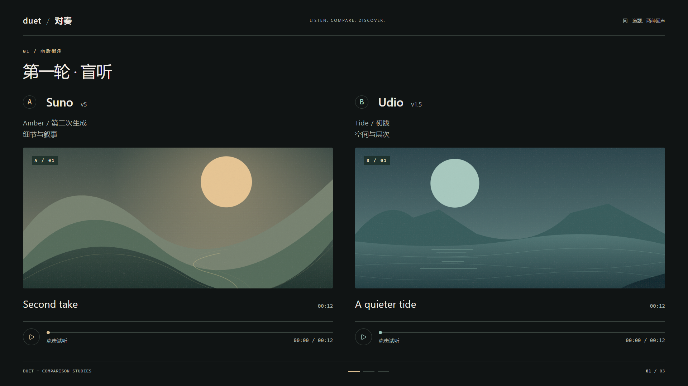
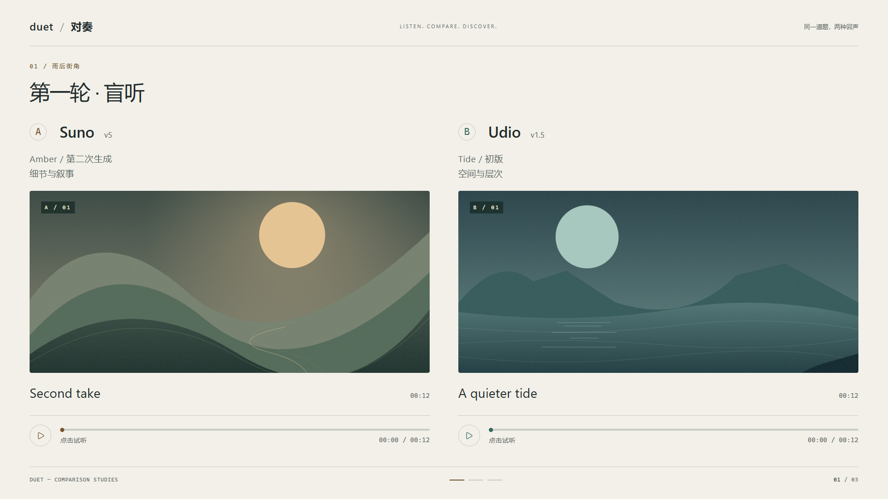
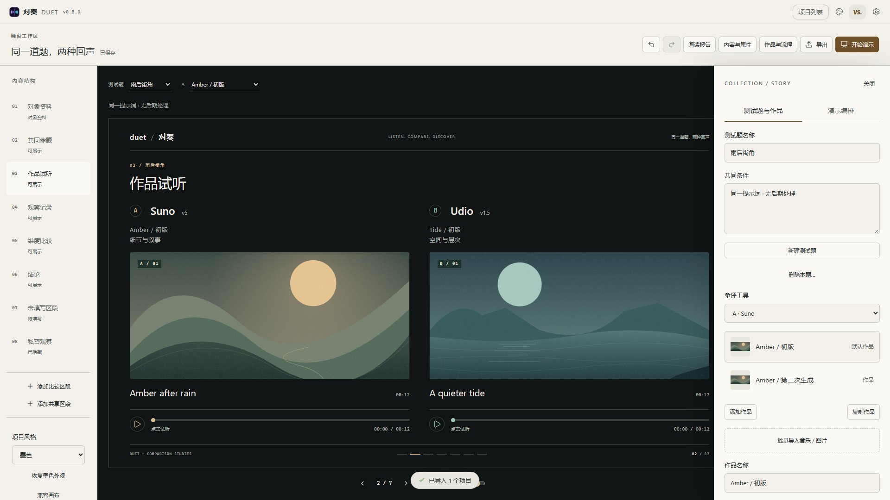
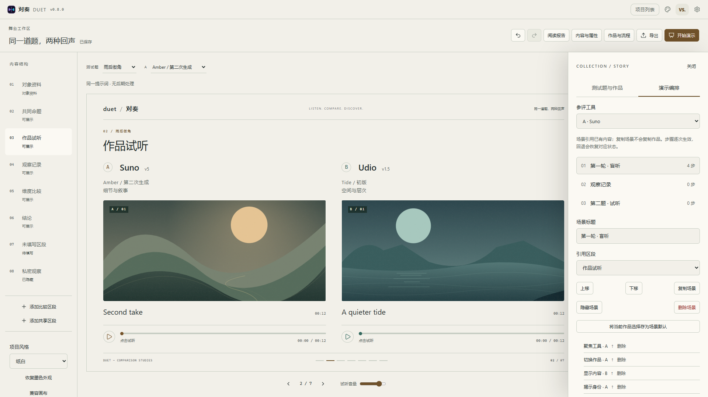

# R3 多作品与演示编排

版本：v0.8.0；工程与 IndexedDB schema：9。日期：2026-09-20。

R3 将 R2 的舞台接入多测试题、多作品和独立场景编排。继续采用墨色／纸白、成对试听和按维度对齐的数据排版，仍开放两方比较；三至六方及更多版式属于 R4。

## 使用方式

新建舞台项目，或将旧工程另存舞台副本。点击顶栏 **作品与流程**：

- **测试题与作品**：管理题目、共同条件、各工具的作品名称和本次生成的补充条件。可以添加、复制、隐藏、删除作品，也可以批量导入音频／图片；列表提供封面预览，超过六份作品时可搜索。
- 舞台上方分别选择测试题和 A／B 作品。只有一份作品时省略作品选择器；每个舞台明确显示作品名称。换题恢复该题默认作品，缺项显示“本题未提供样本”，不会沿用上一题输出。
- **保存当前对比组合**：保存明确的工具 → 作品映射。临时选择不写入工程；“设为默认”和保存组合是可撤销的显式编辑。
- **演示编排**：场景引用题目和内容区段，可添加、复制、隐藏、重排、删除，单独修改场景标题。复制场景不复制作品内容。可以将当前作品组合保存为场景默认，并追加显示内容、聚焦工具、切换作品、揭示身份四种步骤。

删除作品或题目前，会说明关联场景／步骤／组合如何处理；确认清除引用后整体进入一次撤销。隐藏作品保留原始数据及资源。更换音频而保留歌词时，会标记歌词待复核，并提供“确认保留歌词”。

## 展示与播放

| 操作 | 键盘 | 结果 |
| --- | --- | --- |
| 前进 | → / PageDown / 空格 | 执行下一步；步骤结束后进入下一场景 |
| 回退 | ← / PageUp | 从场景默认值重新计算前一步；跨场景回到上一场景末步 |
| 首尾跳转 | Home / End | 到首／末场景起点并暂停 |
| 试听 | P | 播放／暂停聚焦工具的首个音频，无聚焦时选择 A |
| 聚焦 | 1 / 2 | 切换聚焦，界面亦有按钮 |
| 放大 | Enter | 放大聚焦的内容，界面亦有按钮 |
| 全屏 | F | 浏览器全屏 |
| 退出一层 | Escape | 帮助／局部聚焦 → 全屏 → 干净画面 → 编辑 |
| 帮助 | ? | 打开快捷键说明并暂停 |

输入框、按钮、选择框、原生媒体控件、输入法组合过程、按键重复和模态窗口不会被演示快捷键抢占。场景选择器支持直接跳转，重新开始会清除临时状态。步骤默认不自动试听；通过 P 或播放按钮开始，跨场景连续播放本期不开放。

运行态保存场景、步骤、题目、各工具所选作品、聚焦、揭示和暂停状态，与工程内容、撤销历史分离。回退重新计算步骤前缀；重新进入场景使用保存的默认值，不自动恢复临时覆盖。

音频轨道使用项目／题目／工具／作品／模块组成的标识，歌词时钟使用同一作品的复合标识。换题、换作品、跳转和离开页面停止旧媒体；新作品从零暂停。媒体异步解析保留过期结果保护。修复了旧音频渲染器将新的数据对象误判为更换音源，导致时长清零、同步控制栏消失的问题。

## 数据与恢复

- `sheet.sides` 继续作为工具身份的唯一存储，避免复制工具配置；新增 `comparison.cases / scenes / combinations` 保存题目、作品、内容区段、场景和引用。
- `sheet.rows` 是首题默认作品的兼容投影。现有模块编辑器及渲染器通过投影复用，编辑命令回写当前作品。兼容画布显示首题默认作品；其它题目与作品继续保留，回舞台访问。
- 旧 paired 行进入作品的 `contentBySection`；full 行保留全部共享格，包括第二侧历史隐藏内容。未知模块、标题、属性、锁定、隐藏及排序不丢弃。
- v1—v8 的数据库和文件导入共用纯迁移函数；一个数据库升级事务内逐记录校验，任一失败整体回滚。旧字段迁移函数继续保留。
- 升级前的 sheet 和 schema 保留为 `migrationSnapshot`。导出窗口可下载对应旧 schema 的恢复工程，包含原始内容、布局和媒体引用。新版数据不能交给旧版编辑，但恢复工程可以。
- 校验所有作品与区段的唯一 ID、默认作品、场景、步骤和组合引用，包含未选中的作品。复制工程重建实体 ID 和引用；媒体与工具库 ID 保持引用关系。导出、备份和未引用媒体清理共用资源遍历器，覆盖所有作品和恢复快照。
- PWA 更新仍由用户触发，演示期间不刷新，待保存编辑先落盘。旧标签页在数据库版本变化时关闭旧连接，避免继续写入旧 schema。

## 导出

**工程 `.duet`** 保存全部题目、作品、组合、场景、步骤和恢复快照，包括隐藏与未选中内容。

**PNG** 默认完整阅读报告，可切换为当前场景；当前场景又可选择“只保留当前步骤”，保留当时的隐藏和聚焦。导出不切换舞台的运行态，完成后仍在原来的题目、作品和步骤。匿名身份在输出中保持匿名。

**只读网页** 默认包含作品切换和步骤。使用同一个 `ProjectScene` 和解析器预渲染画面，再加入轻量的离线控制脚本；复用相同的默认值与步骤计算。媒体在单文件中去重，播放互斥；可切换作品、前进、回退、跳转、重新开始及全屏。匿名网页不携带原始工具身份映射，揭示步骤也不会把匿名工具名称写进文件。

本期离线网页上限为 **120 个画面组合、80 MB 文件**，通常单个待内嵌媒体上限为 20 MB。超过组合／体积限制或媒体无法完整内嵌时明确报错，不生成残缺的“离线演示”；取消“网页包含作品切换与演示步骤”可输出当前题目的静态阅读页。静态页继续使用原生媒体控件，外部媒体限制会列出提示。多方、长图分页和更大型媒体包不在本期范围。

## 验证与画面

- `npm run check`：编码、TypeScript、ESLint、188 项主题／设计对比度检查及 574 项单测。
- 91 项浏览器测试全部通过，覆盖既有编辑、同步音频、R0—R2 回归，以及 R3 换题／换作品、步骤回退、删除撤销、组合、批量图片、场景复制和恢复工程下载。
- `npm run build` 通过；首屏 JS 为 157.1 KB gzip，CSS 为 9.6 KB gzip，均在体积预算内。
- 离线导出网页实际打开，验证切换、播放、暂停和匿名输出；生产构建验证 PWA 离线重开、已存封面和播放。
- 墨色／纸白在 1920、1440、1280、390 像素宽度检查。较长内容允许展开阅读，手机使用纵向内容流，不缩成不可读的小字。

下列画面来自真实运行应用，音乐、封面及文字为验收素材，不代表平台评测结论。

