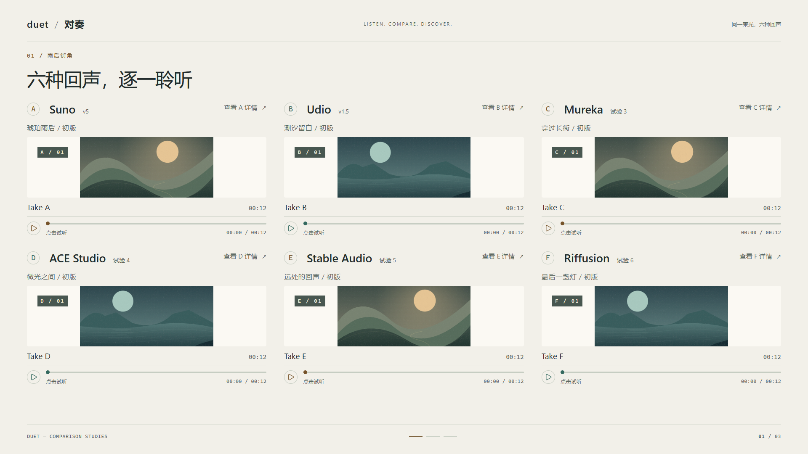
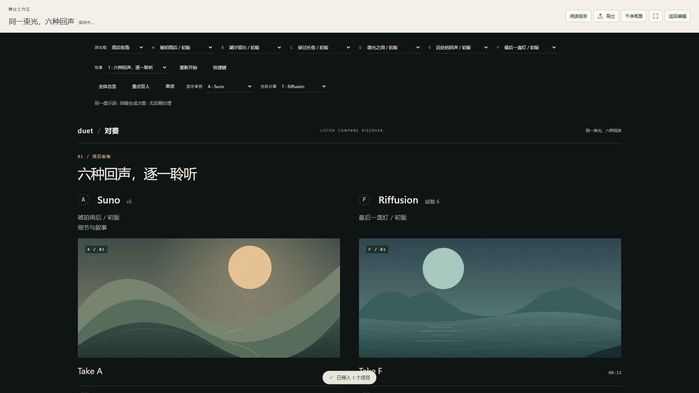
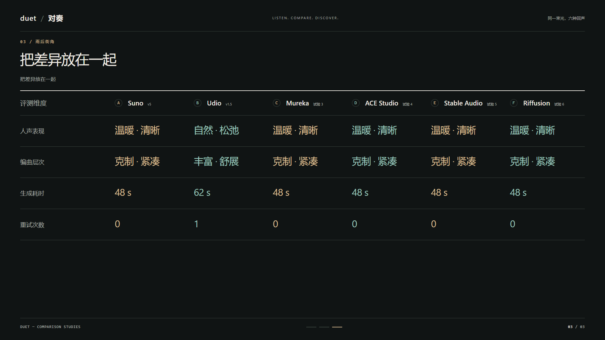
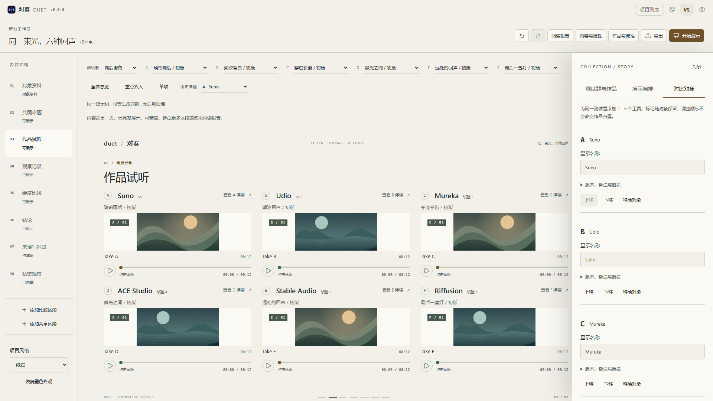

# R4 多方对比与观看方式

版本：v0.9.0；工程及 IndexedDB schema：10。日期：2026-09-20。

R4 将作品舞台扩展到 2—6 个对象。继续使用墨色／纸白与克制的两组强调色；对象通过稳定的 A—F 标记区分，不为六个工具增加六种大面积底色。

## 使用入口

1. 新建音乐、图片或通用评测舞台，打开 **作品与流程 → 对比对象**。
2. 添加工具、修改显示名称，展开版本、备注与匿名设置，使用上移／下移调整顺序。模板仍从双方开始，可逐个扩展至六方。
3. 在 **测试题与作品** 中选择工具，录入、复制或批量导入作品。每个对象在每道题目中有独立的作品与默认选择。
4. 在舞台上选择 **全体总览／重点双人／单项**，或直接点击某个对象的「查看详情」。设置固定参照后，查看详情会进入该参照与当前对象的双人对比。

移除对象会先说明影响：删除该对象在全部题目中的作品，清除场景、步骤与组合引用；共同内容继续保留。确认后作为一个可撤销操作保存。至少保留两个对象，最多六个。

## 画面与讲解

| 对象数 | 总览 | 深入查看 |
| --- | --- | --- |
| 2 | 原有等宽双方舞台 | 聚焦与单项放大 |
| 3 | 三列横排 | 任选对象或重点双人 |
| 4 | 2×2 | 固定参照与当前对象 |
| 5 | 3＋2，末行居中且等宽 | 全体／重点双人／单项 |
| 6 | 3×2，全部对象同时可见 | 全体／重点双人／单项 |

音乐总览保留身份、作品名、首个主要媒体和试听入口。额外媒体、详细歌词与长评在单项、重点视图或阅读报告中展开；文字型区段总览显示首个内容模块。图片默认完整展示，不因横竖比例不同裁掉内容。较长内容仍可展开阅读。

六方桌面总览已在 1920×1080、1440×900、1280×720 检查；前两行试听入口均在画面内。手机使用纵向排列和单项阅读，横向不溢出。阅读报告自然延展，多方内容按两列或三列分组，不挤成六条窄栏。

数据表按可用宽度显示全体或分组，窄表每组重复维度名，设置固定参照后每组保留该对象。重点双人视图中，固定参照位于左边；回到总览保持原对象顺序和作品选择。值仍按维度与单位对齐，零值与缺项继续明确保留，不自动排名。

数字键 **1—6** 对应 A—F 标记，排序后不重新编号；只转移焦点，不自动播放。Enter 在总览与单项之间切换，Escape 退出局部观看。R3 的前进、回退、跳场景和重新开始继续可用。观看方式与固定参照是临时讲解状态，不进入内容撤销历史；重新打开项目回到总览。

## 数据与媒体

- `sheet.sides` 扩展为至少两项的对象数组，入口校验限制为 2—6；`catalogueLabel` 将标记绑定到对象身份。旧项目按原顺序补齐 A／B 等标记。
- 添加、移除和排序都通过命令层，一次包含全部题目与引用变更；作品不随对象排序重新复制或编号。复制工程仍重建实体 ID，保持内部引用一致。
- schema 9 升级保留完整作品数据；没有既有恢复快照的项目保存原 sheet 与 comparison。已有更早快照继续保留，可从导出窗口下载对应版本的恢复工程。文件与数据库使用同一迁移和校验路径。
- 多方项目使用舞台，兼容画布继续服务双方项目。共同区段内容不会因移除原首个对象而丢失。
- 剧场只挂载当前场景。单项和重点视图只挂载观看对象；总览加载当前所选作品的主要媒体。编辑器的当前素材预览独立于舞台计数。
- 换作品、换场景、切换观看方式时暂停旧媒体；隐藏或未选中的作品继续保留资源引用，导出、复制、备份与媒体清理覆盖所有题目和恢复快照。

## 导出

`.duet` 保存全部对象、题目、作品、步骤和恢复快照。PNG 可导出当前观看范围或完整阅读报告；完整报告包含全部对象。

只读 HTML 支持 3—6 方作品选择、总览／重点双人／单项、固定参照、场景步骤与离线原生媒体播放。匿名对象仍不附带身份映射。

多方网页预渲染默认画面及每个对象的作品变体，离线脚本组合经过渲染的片段。以六方各两份作品、一个无步骤场景为例，需要 **13 份片段画面**，避免生成 729 份包含缺样本选项的完整组合。参数表补齐变体中的维度，切换另一份作品时不会把数值留在旧维度下。不同媒体类型混合时保留各对象的模块内容。

仍采用 R3 的 120 份预渲染画面、80 MB 文件上限；重复媒体只嵌入一次。超限有明确提示，可减少场景／作品或改为静态阅读页。个人风格预设、大型素材包与长图分页继续属于 R5。

## 验收

- `npm run check`：编码、TypeScript、ESLint、188 项颜色对比度检查；579 项单测通过。
- 全套 100 项浏览器测试通过，含 R0—R3 回归与 9 项 R4 测试。新增覆盖对象管理与撤销、六方独立作品选择、固定参照、按需挂载、表格分组、3／4／5／6 方剧场尺寸、图片与手机单项视图、实际打开离线网页。
- `npm run build` 通过，首屏 JS 160.8 KB gzip、CSS 10.4 KB gzip，均在预算内。生产构建实际通过 PWA 离线重开、六方本地封面、第二份作品试听及固定参照切换；浏览器控制台无错误。
- 视觉检查使用 Microsoft Edge，窗口宽度为 1920、1440、1280、390 像素；这不等于所有浏览器均已完成适配验收。

以下为真实应用截图，使用验收音频与封面，不代表平台评测结论。

