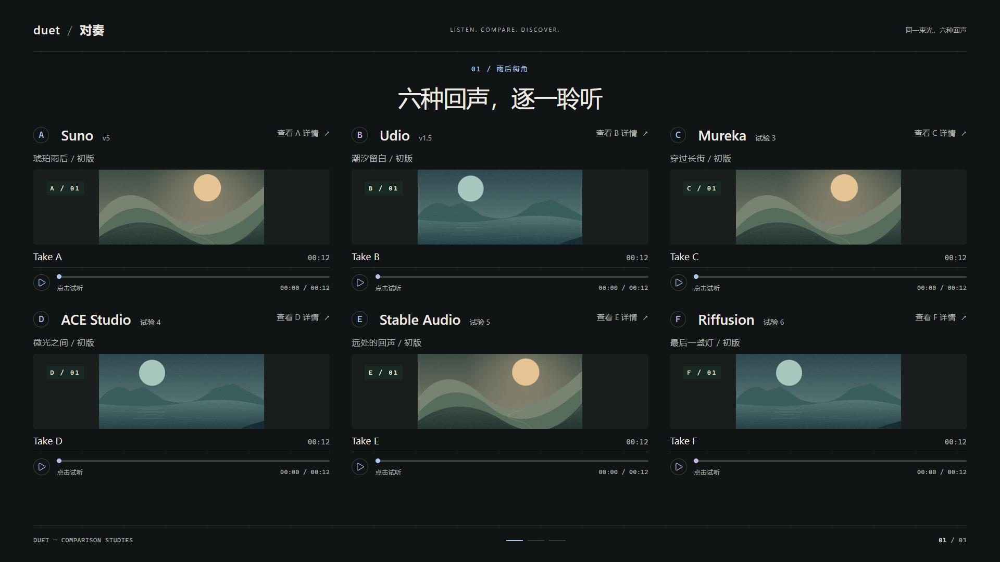
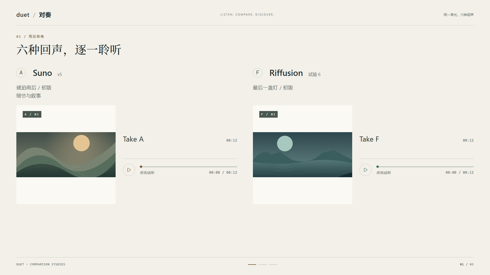
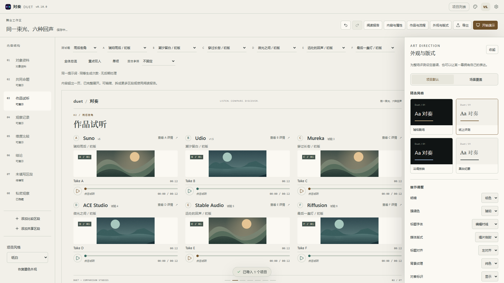
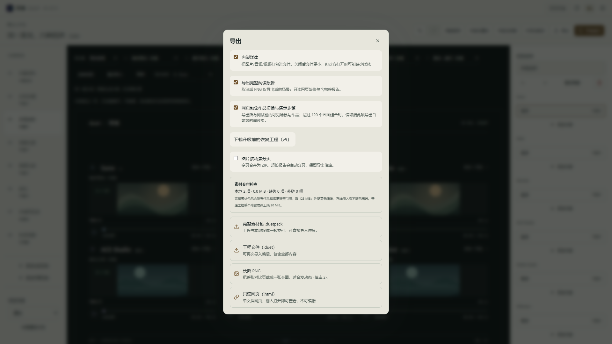

# R5 外观预设与交付验收

版本：v0.10.0；工程及 IndexedDB schema：11。日期：2026-09-20。

本阶段交付有限外观自定义、个人预设、分页图片和完整素材包。主验收使用 Windows 11（10.0.26200）、i9-13900H、32 GiB、Edge 153.0.4234.32；另测试 Firefox 155.0 和 Playwright WebKit 26.6。Safari 实机及场景切换帧预算的限制见末节，不以 WebKit 自动化替代 Safari 验收。

## 1. 外观与版式

工作区顶栏打开「外观与版式」，实时预览，修改支持撤销与自动保存。

| 预设 | 风格 |
| --- | --- |
| 琥珀剧场 | 墨色、暖色强调、宽幅试听舞台 |
| 纸上评测 | 纸色、衬线标题、唱片侧封 |
| 冷调放映 | 墨色、冷蓝强调、居中标题、细线背景 |
| 黑白纪要 | 纸色、黑白强调、衬线标题 |

可组合明暗、强调色、标题字体、媒体版式、标题对齐、背景纹理、品牌标识与项目名称八项。使用受控枚举，不开放任意 CSS。封面保持 contain，不裁掉作品；侧封用于双人／单项舞台，多方总览继续使用紧凑布局。手机纵向阅读。

继承顺序：系统默认 → 原项目明暗 → 项目外观 → 场景覆盖；模块自身显式样式继续保留。场景的每一项都可选择「继承项目」，也可以整体「恢复项目外观」。项目可「恢复系统默认」，不删除场景的显式覆盖。

编辑器、演示、PNG、静态及可交互 HTML 共用场景解析后的外观；多个场景引用同一区段时按当前场景选择覆盖。内容结构没有对应演示场景的区段仍可调整项目默认。

个人预设保存在本机独立记录，可命名、删除、导入和导出 `.duetstyle`。应用时复制选项，删除或更改个人预设不会连带改变已应用的项目。导入严格检查格式、字段和值，限 16 KB；文件仅含名称及八项外观，不含作品、参评对象、媒体、ID 映射或评价。

schema 10 工程首次升级时保存原 sheet 和 comparison；已有更早的恢复快照继续保留。恢复工程剔除 R5 新增的项目外观字段，避免将新结构写回旧版本文件。

## 2. 图片、网页与素材交付

| 格式 | 内容与边界 |
| --- | --- |
| `.duetstyle` | 外观选项，可跨项目复用；不包含内容 |
| `.duet` | 可编辑工程；可内嵌媒体，单个媒体默认限 20 MiB，未内嵌项明确提示 |
| `.duetpack` | 可编辑工程、全部引用的本地媒体、清单及说明；标准无压缩 ZIP，整体限 128 MiB |
| PNG／分页 ZIP | 当前步骤、完整场景或当前题阅读报告；按尺寸自动分页，也可主动勾选「图片按场景分页」 |
| HTML | 只读报告或可交互离线演示；沿用 120 个画面组合、80 MB 演示文件及单媒体 20 MiB 内嵌边界 |

图片每页不超过 8192 像素单边、1600 万像素，最多 40 页；保持选择的 1×／2× 倍率。优先在场景边界分页，超长场景按连续区域分段，尽量避开文字行和普通尺寸图片。极大媒体或复杂重叠内容仍可能跨页，导出提示与 README 会说明。多页一次下载 ZIP，内含顺序命名 PNG、尺寸／偏移清单和阅读说明；单页仍可直接下载 PNG。

分页逐页分配有限画布，不先生成整张超大长图再裁切。修复原先最低 1× 导致超长内容仍超画布上限的问题；修复离屏坐标残留导致空白图片，以及截图库向 `blob:` 地址追加缓存参数导致本地封面失效的问题。测试解码每页 PNG 并检查像素内容，避免把“生成了文件”当成导出成功。

完整素材包遍历所有测试题、非激活作品、恢复快照和派生封面；缺失媒体、未镜像外链、失效临时 URL 或在线嵌入页会阻止完整打包，普通工程导出仍可使用。原始来源链接不算离线依赖。素材检查显示资源库二进制体积，工程内的 data URI 也会计入最终 128 MiB 限额。

导入 `.duetpack` 通过现有「导入工程」入口。校验包大小、路径、条目数量、CRC、目录与本地头一致性、媒体元数据、工程结构和全部资源引用，再写入媒体和工程。拒绝压缩／加密条目、重复或越界路径及缺项，避免半份素材包被当作完整交付。已验证 21 MiB 非激活 WAV 随包往返，不受普通工程单媒体 20 MiB 限额影响。

## 3. 自动化与视觉检查

- `npm run check`：编码、TypeScript、264 组颜色对比、ESLint、607 项单元测试通过。
- `npm run build`：生产构建、PWA 产物、首屏预算检查通过；首屏 gzip JS 169.2 KB，CSS 10.7 KB。
- Edge 全量浏览器回归：105 项通过；涵盖历史工程、编辑／撤销、匿名、播放、作品切换、六方布局和新交付格式。
- Firefox：五项 R5 流程通过，包括实际打开离线 HTML 播放、带本地封面的分页 PNG、自动长报告分页及素材包往返。
- 展示截图检查：1920×1080、1280×720 的纸色侧封和冷调总览；390px 手机无横向溢出，内容纵向展开。
- 生产版 PWA 断网重载：个人预设、项目强调色、六方封面、非默认作品播放、固定参照切换通过，页面异常为零。

跨浏览器复验入口：安装对应 Playwright 浏览器后运行 `npm run test:cross`。该配置不会跳过已知不支持的能力，也不会把失败改写成通过；Windows WebKit 的下面两项限制会产生失败。

## 4. 性能记录

在 1920×1080 的生产构建上，六方各十份独立本地 WAV（12 秒）和两张共享 SVG 封面；监测媒体元素、对象 URL、两次 requestAnimationFrame 后的界面切换完成时间及连续帧间隔。样本切换与场景往返分开记录，数值包含渲染与浏览器调度，不等于音频开始发声的延迟。

| 操作 | 切换完成 p95 | 帧间隔 p95 | 最大帧间隔 | 资源稳定性 |
| --- | --- | --- | --- | --- |
| 连续切作品 50 次（前 30 次计时） | 37.2ms | 18.3ms | 30.3ms | 媒体节点 6→6；URL 8→17，覆盖首次访问的另外 9 份作品 |
| 试听／观察场景往返 30 次 | 55.6ms | 36.4ms | 42.5ms | 媒体节点 6→6；URL 8→8 |
| 延长到 100 次作品切换 | 30.4ms | 12.4ms | 30.3ms | 媒体节点 6→6；最终 URL 仍为 17 |

本地作品切换达到约 300ms 的目标，50 次压力样本的帧间隔 p95 达到约 20ms 目标；**场景往返的帧间隔 p95 仍未达到 20ms**，不能宣称所有切场景均为稳定 60fps。往返会销毁离场媒体并重建当前页，优先保证不串音和宿主数量有界。后续优化应继续约束媒体节点数量，不以保留全部隐形播放器换取帧率。

原始结果见 [性能记录 JSON](benchmarks/r5-performance.json)。大量内嵌 data URI 字符串的旧工程与本地 assetId 夹具不能混用为同一个性能基准。以上是同机单次记录，调度和解码有波动。

新舞台的已有媒体缓存现在同步进入首轮渲染，避免先画空封面再等待已就绪的 URL；场景的几何测量按动画帧合并，并在卸载时取消。迟到的异步媒体仍不能覆盖新选择，有独立回归测试。

## 5. 仍需明确的验收边界

1. 当前 Windows Playwright WebKit 26.6 的原生 IndexedDB 写入 16 字节 Blob 也返回 `UnknownError: Error preparing Blob/File data to be stored in object store`；同环境字符串和 ArrayBuffer 写入成功。WAV 的 blob URL 播放返回 `NotSupportedError`，原生 data URI 播放也未在探测限时内开始。已用不调用项目服务的最小样例复现。因此本环境仅能确认外观交互和不依赖 Blob 存储的图片渲染，不能声称 WebKit 媒体／素材包通过。
2. macOS／iOS Safari 没有可用实机，尚未验收。需在该平台补测本地媒体、离线 HTML、工程导入和分页 PNG。
3. 性能数字限于上述设备与夹具；场景往返实测帧间隔 p95 为 36.4ms，20ms 目标尚未达到。
4. 无桌面安装包、任意 CSS、自由坐标画布、云同步或视频渲染。预设是可迁移的外观组合；PNG 是静态输出，作品切换与演示步骤使用 HTML。
