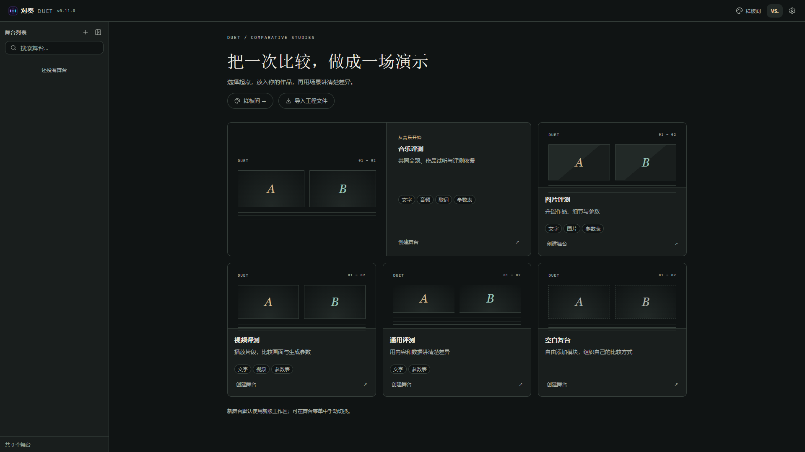
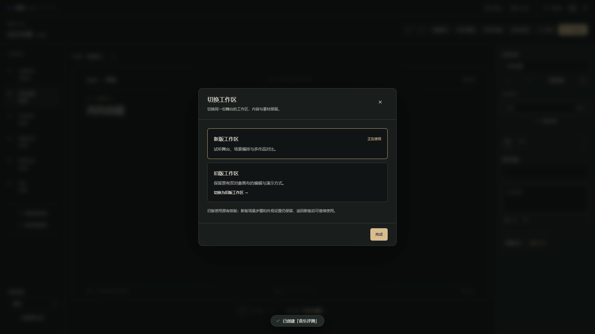
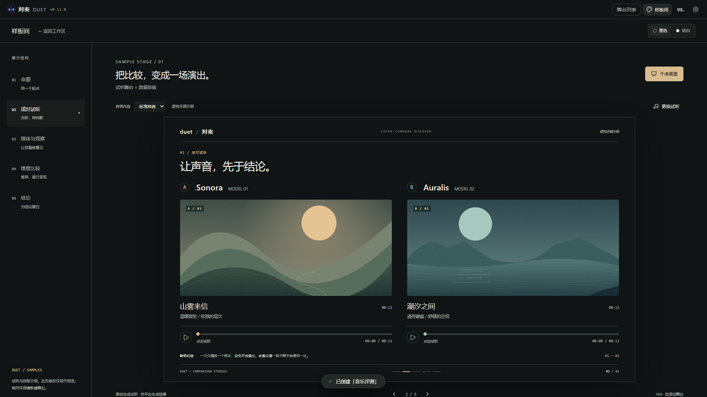

# W1 工作区入口与迁移验收

日期：2026-09-20。应用版本：**v0.11.0**。工程 schema：**12**。

本阶段依据 [新版工作区产品化施工方案](09-新版工作区产品化施工方案.md)，完成工作区身份、默认创建、历史迁移与主界面入口整合。后续音乐编辑闭环属于 W2，样板版式与可编辑示例属于 W3；本记录不将 W1 视为整轮产品化完成。

## 1. 用户可见变化

- 首页提供音乐评测、图片评测、视频评测、通用对比和空白舞台，全部进入新版工作区。音乐是主要推荐项，模板只决定初始内容。
- 新版和旧版都在现有对奏外壳中打开，共用舞台列表、导航和设置。首页采用中性色、轻描边与留白；约 390px 窄屏首次打开时自动收起列表，避免内容被挤窄。
- 编辑时点击顶栏「新版工作区」或「旧版工作区」，在「切换工作区」窗口内手动切换。舞台 ID、标签页与素材不另建副本；切换可以撤销、重做。
- 样板间保留视觉、试听和临时编辑演示，并接入主应用导航。从样板间点击侧栏舞台可回到真实工程，干净画面会隐藏导航并隔离后台快捷键。
- 原「组件规范」改为「设计规范」，入口为「设置 → 关于 → 开发与设计」。它用于开发时检查色彩、文字、控件和窗口的一致性；用户定制仍通过新版工作区的「外观与版式」。

### 实际界面

以下为本地运行的真实截图，示例内容不代表任何平台的评测结论。

## 2. 切换规则与保存

旧版维持双对象画布的原有能力。以下任一条件存在时，窗口禁用旧版入口并逐项说明原因：

| 情况 | 处理 |
| --- | --- |
| 超过两个对象 | 保留新版与全部对象 |
| 多个测试题 | 保留每题与各自作品 |
| 任一对象有多份作品，包括隐藏作品 | 保留所有作品，不只取当前作品 |
| 有对象没有有效的默认作品 | 保留缺项，不把其他作品代填进旧版 |

兼容舞台切到旧版时使用原有排版；新版的场景、步骤和外观配置继续保存，返回新版可继续使用。比较内容仍使用同一份数据，旧画布只是默认作品的兼容投影。

切换顺序为：等待已排队的自动保存 → 保存当前输入 → 保存新的工作区状态 → 更换界面并记录撤销。切换期间阻止并发编辑和打开其他舞台。任何写入失败都不更换当前编辑器，并在窗口显示错误；慢于旧轮询超时的保存也不会被后一次写入超越。

## 3. 数据与历史工程

- 使用独立 `workspace: 'modern' | 'legacy'` 字段决定编辑、展示与导出路径，不再用外观配置中的 `presentation.enabled` 判断工作区。
- schema 12 严格校验工作区字段。新建默认新版；复制、导入和重新打开保留已选择的工作区。更换外观不会隐式切换工作区。
- 历史工程没有该字段时，根据原展示配置迁移：原新版继续新版，普通双对象旧工程继续旧版。若历史旧版开关下实际已有多对象、多作品、多测试题或缺失作品槽位，则进入能够完整访问内容的新版，保留全部数据。
- 文件导入与 IndexedDB 使用同一校验和迁移路径。已有最早恢复快照继续保留；无快照的 v11 工程保存原画布、作品结构与外观。
- 「恢复升级前工程」输出快照对应的旧 schema，去掉新增工作区字段，恢复快照外观，避免把 v12 字段写进旧格式。
- `.duet` 与 `.duetpack` 继续沿用原有格式与素材机制，正常工程保存工作区；PNG／HTML 的渲染入口按独立工作区身份选择。

## 4. 验证结果

| 检查 | 结果 |
| --- | --- |
| `npm run check` | 通过：UTF-8 编码、TypeScript、264 组颜色对比度、ESLint、38 个文件共 636 项单元测试 |
| 浏览器完整回归 | Windows Edge，116 项全部通过，包含旧编辑器、播放、导出及既有 R1—R5 流程 |
| W1 专项复验 | 11 项全部通过：五类新建、刷新、同 ID 往返、历史导入、限制原因、主导航、390px 首页、v11 恢复 |
| `npm run build` | 通过：生产构建、PWA 产物与首屏体积检查 |
| 首屏 gzip 资源 | JS 172.7 KiB／预算 260 KiB；CSS 12.0 KiB／预算 40 KiB |
| 视觉复核 | 首页、工作区窗口、样板间以及 390px 小屏；修复窄屏内容挤压和模板预览裁切 |

单元回归还覆盖历史数据库迁移、最早快照保留、复制及文件往返、隐藏作品限制、输入与外观保留、保存失败、切换期间并发操作，以及耗时超过 3 秒的自动保存顺序。旧版端到端测试通过冻结的 v8 工程文件从实际导入入口进入旧版，继续验证原有能力；新建行为单独按新版预期验证。

浏览器验证使用 Playwright 配合 Windows 已安装的 Edge，完整回归为 116 项，专项复验不重复计入总数。R5 已记录的性能与 Safari 验收边界仍然有效，本阶段未新增跨浏览器结论。

## 5. 下一阶段

W2 将完成场景与内容组织、模块完整操作、作品资料、属性栏与大编辑窗口，验证用户从自己的两首音乐开始完成创作和演示。W3 再将样板构图接入真实内容，使样板可以建立标准可编辑舞台。当前样板页的临时修改仍不会保存为工程，界面已明确说明这一点。
