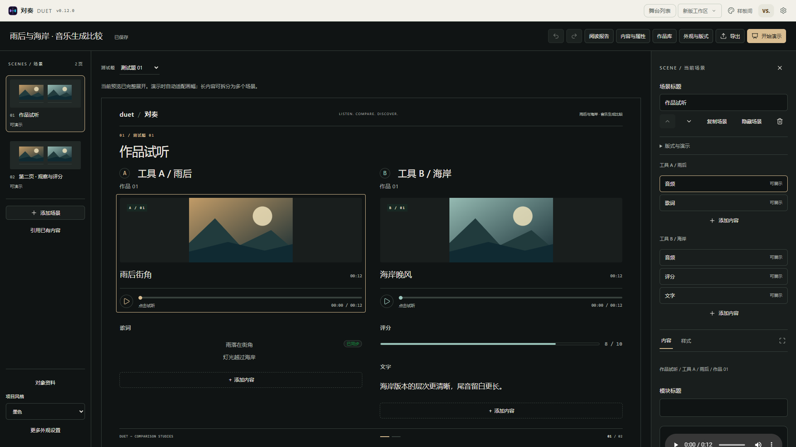
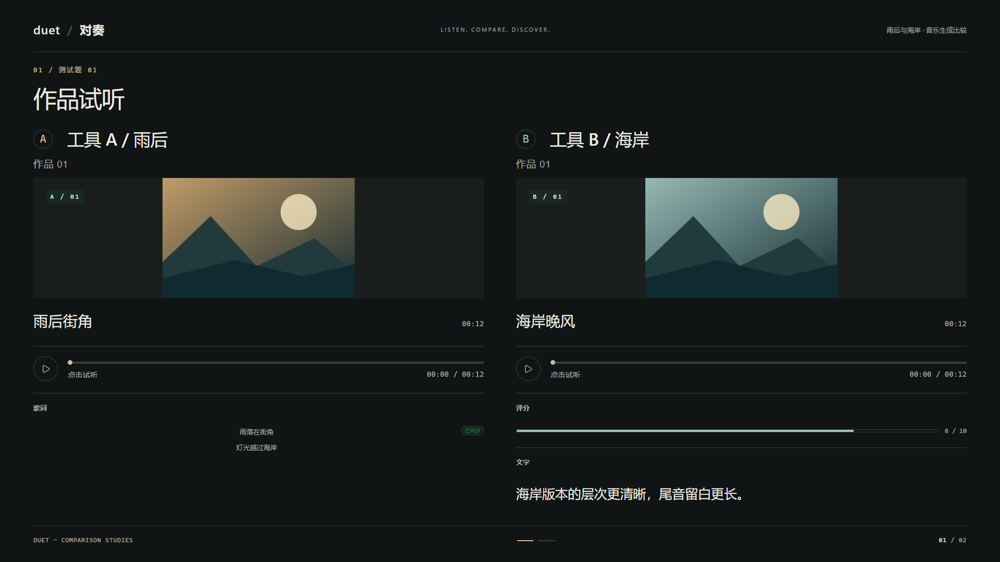
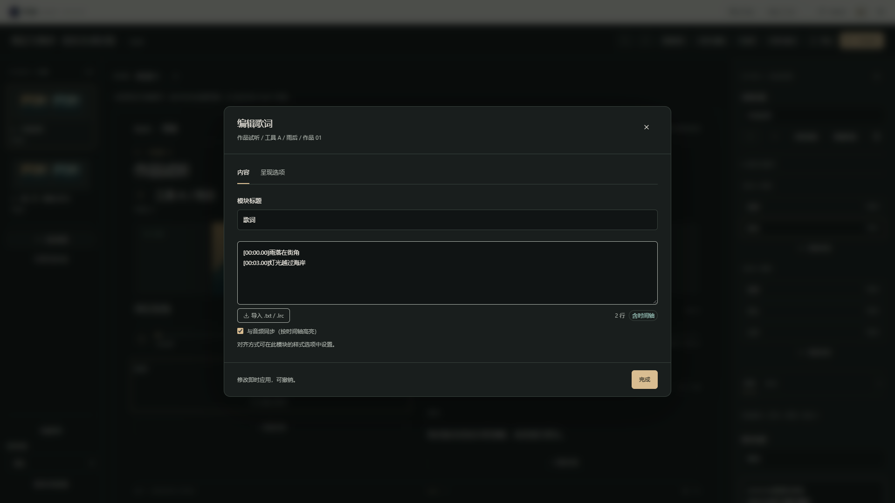
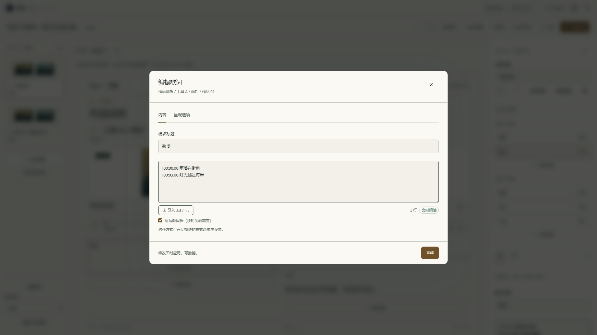

# W2 音乐创作闭环验收

日期：2026-09-20。应用版本：**v0.12.0**。工程 schema：**13**。

本阶段依据[新版工作区产品化施工方案](09-新版工作区产品化施工方案.md)，落实从真实素材开始的音乐编辑、保存、演示和再编辑。命题、观察、数据、结论的专用构图，以及样板创建标准可编辑工程仍属 W3；全产品可用性收口属 W4。

## 1. 从自己的音乐开始

1. 在对奏首页新建「空白舞台」，左侧「添加场景 → 并置试听」。也可以直接选择音乐评测模板。
2. 修改顶部舞台名称，在左侧「对象资料」填写参评对象。进入对应音频模块，上传自己的音频与封面。
3. 点击画布中的内容选择模块，在右侧编辑；双击内容或点击「扩展编辑」打开大窗口。播放器与进度条保持正常试听操作。
4. 点击各对象的「添加内容」，加入歌词、文字观察、参数或评分。右侧可以复制、上下移动、跨兼容位置移动、隐藏和删除模块。
5. 从左侧选择场景，在右侧修改标题、顺序、版式或演示步骤。默认「复制场景」得到独立内容；「引用已有内容」明确共享来源。
6. 等待保存完成，点击「开始演示」。可试听、切页、切作品和运行步骤；「干净画面」用于录屏。退出演示恢复原编辑场景、作品选择与选中模块。
7. 刷新可继续编辑。导出 `.duet` 后导入仍可继续工作；大素材沿用 `.duetpack` 完整素材包。

「作品库」统一包含测试题与作品、当前页步骤、对比对象。它与内容属性、外观共用右侧位置，关闭后恢复属性。左侧始终以场景为主，移除了另一套重复的场景管理列表；音乐、歌词、评分等编辑上下文明确显示所属对象与作品。

## 2. 场景与模块的数据规则

| 操作 | 实际行为 |
| --- | --- |
| 添加场景 | 新建独立内容来源；提供并置试听、通用组合和共同内容，已有模板也可自由增删 |
| 复制场景 | 复制内容、版式和步骤，重建场景、区段、模块与步骤 ID；包括未激活及隐藏作品的对应内容。文件资源可以复用，内容修改不联动 |
| 引用已有内容 | 新场景共享所选来源；列表和属性显示共享关系，修改来源会影响其引用场景 |
| 删除场景 | 默认保留来源内容，可再次引用；只有主动勾选且无其他引用时才一并移除来源及各作品中的对应模块 |
| 场景排序与隐藏 | 排序只调整演示组织；隐藏页仍可编辑，正常演示与阅读报告跳过隐藏页 |
| 模块移动 | 只列兼容的对象／共同区域和有效作品；保留模块身份与素材，支持撤销，不误写默认作品或缺失作品槽位 |
| 切换版式 | 并置试听与通用组合共用模块内容，不清空素材和文字；超长内容展开为阅读布局 |
| 保存失败 | 显示错误与重试入口；切换舞台和关闭标签页不丢弃未保存内容，不把失败当作成功 |

编辑预览中的空模块和隐藏模块保持可见，并说明状态；演示过滤这些内容。多个对象的模块数量可以不同。三至六对象总览在编辑时保留全部模块入口，演示继续使用既有紧凑总览与单项查看。

修复了非默认作品内移动模块时重复投影到默认作品的问题；异步上传回调检查原编辑位置，避免切换后把素材写入另一作品。场景溢出状态按真实内容变化重新测量，避免重绘循环造成输入回退、页脚盖住按钮或长内容无法展开。

## 3. 实际画面

以下截图来自正式新版工作区。工程通过界面从空白建立，上传自制测试 WAV 和 SVG 封面，并录入歌词、观察与评分；这些素材与评价仅用于验证，不代表任何平台实测结果。

新版属性、上传区、模块选择器和大窗口继承同一墨色／纸色配色；内容与呈现选项分开，保留清楚的当前编辑位置。修复旧模块输入框在深色窗口内出现浅底浅字的问题，并在浏览器里验证实际文字对比度。

并置试听根据是否混排其他模块调整封面与留白，常见的音频、两行歌词、评分和简短观察组合在 1920×1080 干净画面完整展示。编辑时为操作控件允许额外展开；长文本继续完整阅读，不强制裁切或缩小字体。390px 使用纵向阅读，保留封面、播放和基础修改入口，见[窄屏实际截图](screenshots/w2-mobile.png)。

## 4. 迁移与交付

- schema 13 增加可选场景版式 `general`／`listening`。旧场景继续通用版式，未知版式拒绝导入，不静默丢掉内容。
- 历史迁移继续保留最早恢复快照；从 schema 12 升级且无快照时，保存原工作区身份。「恢复升级前工程」按快照恢复相应 schema 和工作区，v11 及以前仍按旧规则导出。
- PNG、HTML、`.duet` 与 `.duetpack` 继续走现有交付服务；阅读报告遵守场景顺序、标题、版式与来源引用，导出不带编辑按钮。
- 旧版仍维持原有能力。W1 的兼容检查与同舞台切换规则不变；本阶段未开发桌面版。

## 5. 验证结果

| 检查 | 结果 |
| --- | --- |
| `npm run check` | 通过：UTF-8 编码、TypeScript、264 组颜色对比度、ESLint、39 个文件共 645 项单元测试 |
| 浏览器完整回归 | Windows Edge，119 项全部通过，含旧版编辑器、R1—R5、W1 与 W2 流程 |
| 最后调整后的针对性复验 | 18 项全部通过：W2 创作／移动／窄屏，R2 长内容与导出，R4 多方布局与交付；不重复计入总数 |
| `npm run build` | 通过：生产构建、PWA 产物与首屏体积检查 |
| 首屏 gzip 资源 | JS 172.6 KiB／预算 260 KiB；CSS 11.8 KiB／预算 40 KiB |
| 视觉与可读性 | 1920×1080、1366×768、1280×720、390px；墨色／纸色大窗口、实际输入文字对比度、手机封面比例与无横向溢出 |

新增单元回归验证场景副本覆盖未激活作品、显式引用与删除、场景排序、非默认作品移动及缺失槽位保护、版式文件往返、v12 工作区恢复快照，以及保存失败时打开／关闭标签页的保护。浏览器回归实际上传合法音频和封面，通过界面完成创作、独占试听、独立复制、演示返回、文件回导和刷新，无数据库预注入来绕过创建流程。

验收截图与长页展开都基于真实浏览器渲染；测试用音乐页的干净画面实测高 1080px、内部纵向溢出为 0，小屏横向溢出为 0。最后的小屏修正取消桌面封面高度限制，并在浏览器中验证 16:10 比例。

## 6. 后续边界

W2 已完成首个用户素材音乐创作闭环。样板间仍为视觉示例，临时修改尚不写入舞台；W3 将把命题、观察、数据和结论构图接入正式内容，并提供「以此创建舞台」与清空示例内容两种方式。现有通用数据表不代表 W3 的版式施工已完成。

本阶段的浏览器验证基于 Windows Edge。R5 已记录的 Firefox／Windows WebKit、Safari 实机与性能边界继续有效；不据此宣称全浏览器验收完成。W4 继续负责跨类型、性能与整体可用性收口。
